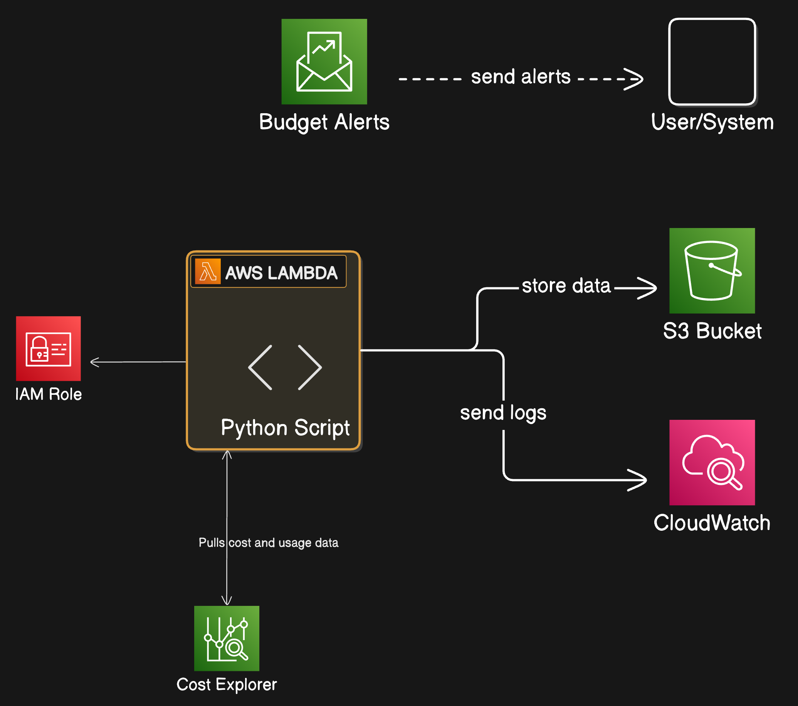

# aws-cur-data-to-s3

### Architecture



### Manual Deployment Steps
1. login to the aws account from AWS CLI
2. export the AWS_PROFILE on the cli
```
export AWS_PROFILE=default
```
3. go to terraform folder
```
cd terraform
```
4. Initialize the terraform, plan it and apply it
```
terraform init
terraform plan
terraform apply
```