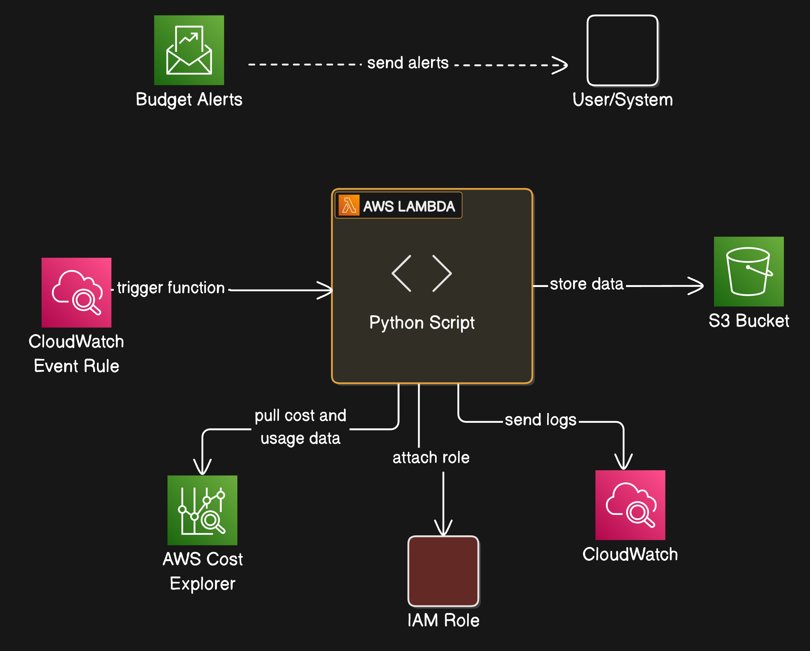

# aws-cur-data-to-s3

```
├── README.md
├── documentation
│   └── aws-cur-data-to-s3.png
├── scripts
│   ├── aws-cur-data-to-s3.py
│   └── aws-cur-data-to-s3.zip
└── terraform
    ├── README.md
    ├── budget.tf
    ├── cloudwatch.tf
    ├── data.tf
    ├── iam.tf
    ├── lambda.tf
    ├── main.tf
    ├── s3.tf
    └── variables.tf
```

### Architecture



### Manual Deployment Steps
1. login to the aws account from AWS CLI
2. export the AWS_PROFILE on the cli. (Make sure your AWS PROFILE is set, either by running below command or by updating `profile = <PROFILE_NAME>` in main.tf )
```
export AWS_PROFILE=default
```
3. go to terraform folder
```
cd terraform
```
4. Initialize the terraform, plan it and apply it
```
terraform init
terraform plan
terraform apply
```